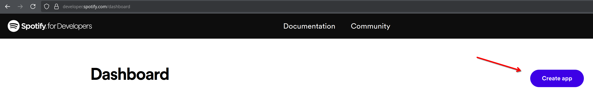
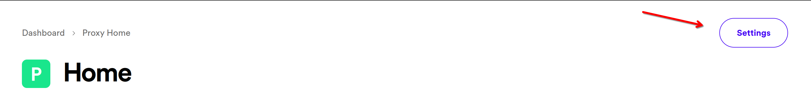

# Spotify Proxy

Spotify Proxy is a Minecraft Java proxy that lets you sync Spotify lyrics with Minecraft using the actionbar.

The proxy currently only supports offline mode servers (cracked) servers and not online mode (premium) servers.

## Showcase

https://github.com/IuCC123/SpotifyProxy/assets/80768059/d8c56a3b-35af-4352-9115-842cee3d0ef8

https://github.com/IuCC123/SpotifyProxy/assets/80768059/0ba56b28-c628-452a-bb7c-3c370339b6ef

## Get started
1. Clone the repository using `git clone https://github.com/IuCC123/SpotifyProxy` or download and unzip the respository by clicking the blue **"Code" button**.
2. Open a terminal inside of the cloned/unzipped folder and run the following command: `npm i`.
3. Duplicate (copy and paste) **config.json.example** and call it "**config.json**"
4. Go to [the spotify developer dashboard](https://developer.spotify.com/dashboard) and login with your existing Spotify account.
5. Once you have logged in, you should see a Dashboard page. Click "**Create app**" on that page to create a new application. 
6. Click the newly created application and click the **settings button**.

7. Scroll down on the settings page and click the Edit button.
8. Add **http://localhost:3000/callback** to the Redirect URIs field.
9. Scroll back to the top and copy your Client ID, put the Client ID in the **client_id** field in the config.json file you created at step 3.
10. Under the Client ID field in the Spotify dashboard, click "**View client secret**" and copy the Client secre, put the Client secret in the **client_secret** field in the same config.json file.
11. Once done, run `node web` in a terminal in the directory of the repository.
12. Follow the steps in the console
13. **Copy your Refresh token** that the web application returns once you have authorized. Put this token in the **refresh_token** field in config.json
14. Now you can edit the config.json file to your likings.
15. Run `node .` and follow the steps sent in the console.
16. Once ingame, send "**!start**" in the chat and wait for the first lyric, it should appear if the song you're playing has synced lyrics.

## List of commands:
- !start
- !stop

*If you need any help, you can always contact me by DMing me on Discord (username: **iucc.**)*
